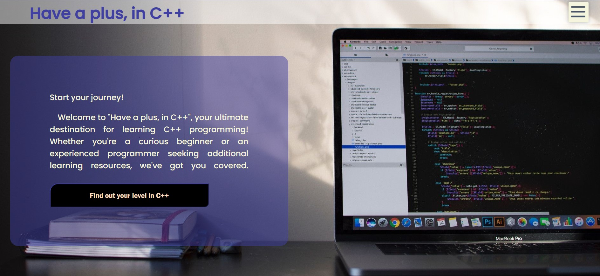
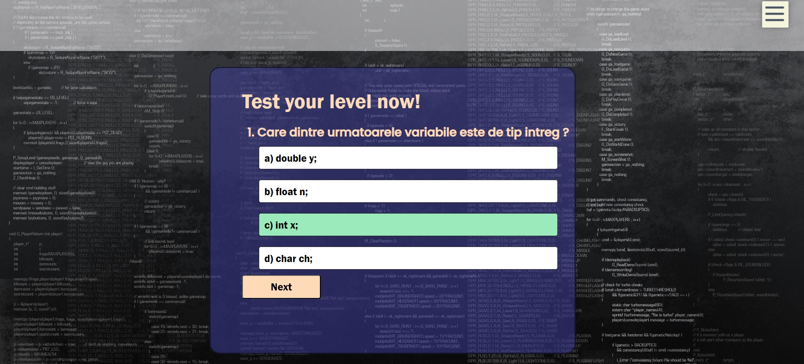
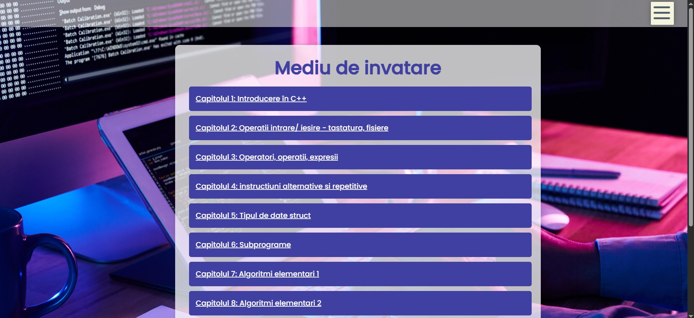
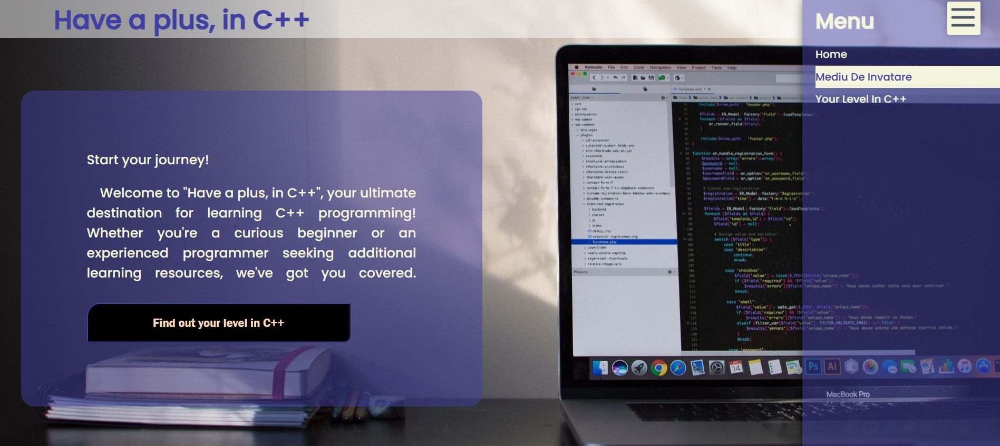

# e-learning-website-contest
"Have a Plus in C++" is an interactive e-learning application designed to help users improve their programming knowledge in C++. The project combines C++, HTML, CSS, and JavaScript to provide a user-friendly and intuitive learning environment.

 

## Main Features
- **Interactive Menu:** Quick access to chapters and easy navigation between topics.  
- **Knowledge Test:** Evaluates users’ skill levels, explains incorrect answers, and provides targeted feedback on chapters that need improvement.  
- **Chapter Structure:** 12 chapters covering fundamental to advanced C++ topics, including algorithms, recursion, arrays, and string manipulation.  
- **User-Friendly Design:** Clear and visually appealing interface encouraging self-paced learning.  
- **Future Development:** AI-based adaptive feedback and personalized mentoring functionalities.

## Technical Overview
- **JavaScript:** Manages quiz flow, evaluates answers, tracks scores, and provides explanations.  
- **HTML/CSS:** Structures and styles the learning environment, including menus, chapters, and question buttons.

 
 
 
 

